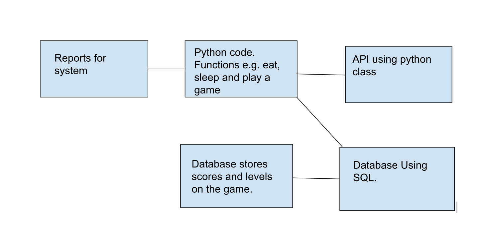
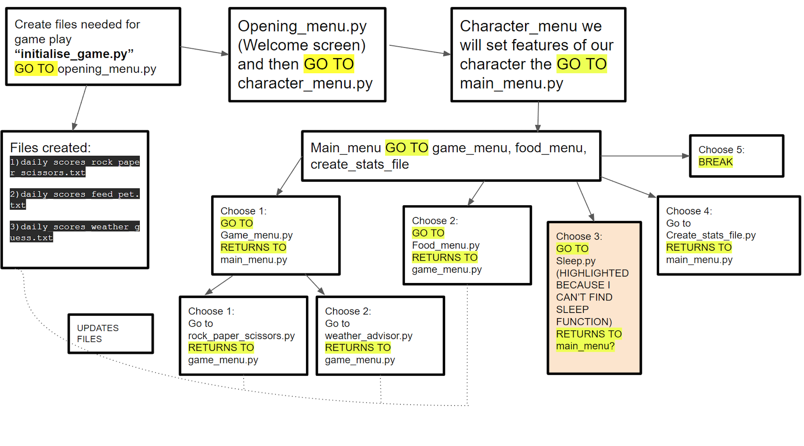

# Homework Week 2 

## 1. What are you building? 
We are building a virtual pet stimulation. Players of our game will need to look after the pet by being able to feed, play and recognise when the pet is tired. Within the game we have added a feature that allows us also to play a game with our virtual pet such as rock, paper, scissors. This game primarily focuses on the raising of virtual pets. 

We will be incorporating the openweatherapi into our program to be used in conjunction with a game. Based on user input, and a dynamic URL endpoint, the API will return information that we will then use, and depending on the retrieved information, a message will be returned to the user. The user will then play a guessing game again using the API to determine whether the user guessed correctly/incorrectly.

## 2. What does it do or what kind of problem does it solve? 

This is a fun game for users to be able to raise their own pets and also a good pastime both adults and children are able to play. The main objective of our game is for users to be able to raise their virtual pet to the maximum level of happiness and contentment throughout each day. We have set the game so that our pet will automatically go into ‘sleep’ mode at 12 am each day and resets each morning.

 Prior research has found that virtual pets have the potential to promote learning, collaboration, and empathy among users. This allows our users to also use this game to connect with kids of other backgrounds as this can be a bridge to bring them together. This program can help users to have a sense of duty and care towards their virtual pet, instilling them with responsibility. Which can be vital for child development. 

## 3. What are the key features of your system? 

We are building a virtual pet simulation game, some of the key features are: 

- A feeding function, when the pet is hungry users are able to feed it accordingly.
- A function to view your pet's current stats, e.g level of happiness they are at. 
- A sleeping function, each day at 12 am the game will rest and go into ‘sleep mode’ and restart in the morning. 
- Play a game function with your pet, where users can play a game of rock, paper, scissors with their pets and a weather game which uses an API.
- A function to create your pet by assigning a name and a gender, we have also built an option for the gender to be randomly assigned. 

## 4. Provide a sample architecture diagram of your system.

## 5. Describe the team approach to the project work: how are you planning to distribute the workload, how are you managing your code, how are you planning to test your system.

### Work Allocation 

**Beth Millard** - Menu screen functions, Page linking functionality, view stats menu, debugging, updating GitHub, SQL Database, connecting Python Backend to DB, present final presentation

**Claire Evans** - Debugging, character creation function, sleep function, conversion to OOP / Classes and Unit testing, Jira tasks, present final presentation

**Eziamaka Nwakile** - Decorators

**Julie Thomas** - Game screen function, rock paper scissors game function, weather API game, feed pet function, view stats menu, leveling of pet / txt file logic, debugging, conversion to OOP / classes and unit testing, set up Jira and add a few tasks to start off, flow diagram of how our files should link. Start final presentation PPT.

**Anisah Mohamud** - feed pet function, exception handling, created the github repository. Documentation - implementation and execution, testing and evaluation and conclusion. 

**Hani Dore** - Homework Week 2,  Exception Handling, Documentation- introduction, background, Acknowledgments, specification and design. 

We arranged a meeting on zoom to introduce ourselves and to consider possible ideas. We then spent the next few days cementing our project idea and ensuring everyone was happy with it. Once we decided on an idea, we then homed in on the project idea and focused on ways to tackle different aspects of the project. We understand that organization of the team and project is crucial to reaching our goal.

All of the team members had access to a Google doc that had been made. Meeting notes and additional documents can be saved in this one location for convenience and is regularly updated. 

We have also created a jira workspace for us all, where we can monitor any progress that we are making and have a clear view of what has been already done and what is still needed to be worked on. We all have access to this and can be edited and modified as we go along. 

Github Repository was created and was shared with all of our team members, this allows us to upload any code and make any changes as needed. We are planning to do some unit testing on our codes to see if our code is working as we wanted and to also be able to see it from a users perspective. 

We created a workplace on slack where we can connect and share links to websites, such as Zoom meetings as well as slack huddle. Our team has been holding regular meetings twice a week. It is important for us to also communicate via regular meetings as we are able to put through our ideas clearly and can work through any issues that have risen during our time. 

