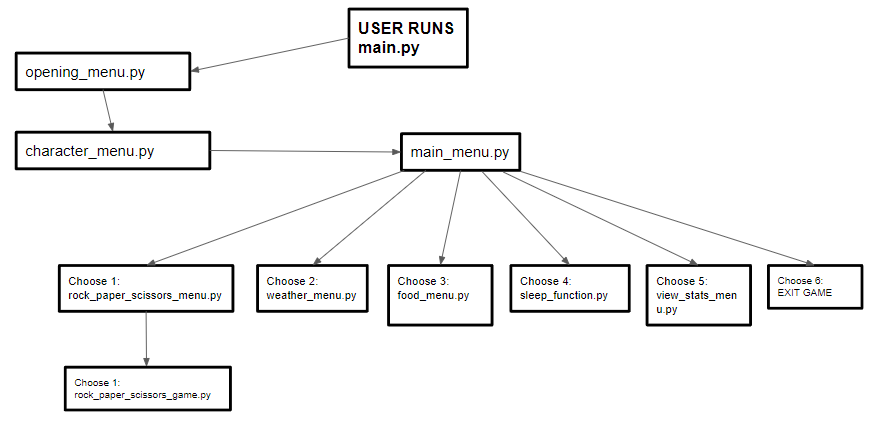

## cfg-group3
### Code First Girls Software 5 Group 3 Project

# **DUMPLING**

## Game overview

**Dumpling** is a virtual pet simulation game. Players of our game will need to look after the pet by being able to 
feed, play and put their pet in sleep/awake modes. Within the game we have added a features that allows us also to play 
with our virtual pet such as rock, paper, scissors, and getting weather advice from our pet with a mini-game feature of 
guessing a city in the world where it is currently snowing.

## Planning Stage

### Tools & Skills required

We will use python to assimilate the logic of our game, including our knowledge of how to effectively use and API.
SQL knowledge will be needed for our back end database which will store name, gender and scores.

### Target Audiences

**Dumpling** is a fun game and pastime for both adults and children. The main objective of our game is for users to be 
able to raise their virtual pet to the maximum level of happiness and contentment throughout each day. Daily scores for 
games are reset at midnight every day, encouraging the user to keep playing in order to keep their pet happy and 
content.

### User Stories

```
Story Identifier 001
As a 
User

I need 
To run one main file in order to play the game

So that
I don't have to worry about other dependancies and requirements the game may have in order for me to play

```

```
Story Identifier 002
As a 
User

I need 
To have a simple menu interface

So that
I can interact easily with my pet

```

```
Story Identifier 003
As a 
User

I need 
To be able to view my pet's current happiness and hunger levels

So that
I can interact with my pet and improve these levels to achieve full happiness.

```

```
Story Identifier 004
As a 
User

I need 
Exit the game

So that
when I have finished playing, I can end my session.

```

```
Story Identifier 005
As a 
User

I need 
to be able to exit out of menus to the previous menu/back to the main menu

So that
my game play can run smoothly and if I enter into a menu by accident I can return to the previous screen.

```

### Diagram of user interaction




## The Team

### People responsible for creation and maintenance of the project and their github usernames

**Anisah** aniwin

**Beth** ejmillard

**Claire** clairelev

**Hani** hanidore

**Julie** juliethomas82
